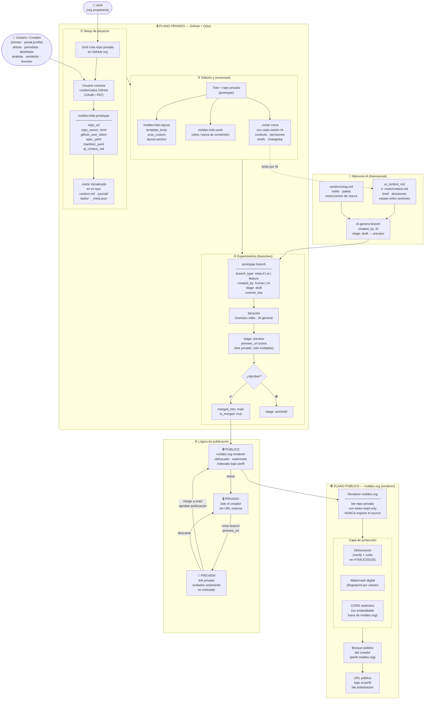

# Moldeo Lab — Arquitectura y ciclo de vida completo

> Plataforma de creación, edición y publicación de contenidos interactivos para artistas,
> periodistas, creativos, diseñadores, analistas de datos, vendedores e inventores.
>
> **Principio central:** ctmil crea y custodia los repos privados; el usuario los opera
> con sus propias credenciales GitHub; moldeo.org es el único punto de renderizado público.

---

## Modelo de identidad y propiedad

```
ctmil (org GitHub)
  └── crea repo privado  ──────────────────────────────────────────────┐
        │                                                               │
        │  usuario conecta OAuth / token GitHub propio                 │
        │  → commits firmados por el usuario (autoría verificable)     │
        │  → ctmil mantiene ownership (protección del repo)            │
        │                                                               ▼
        └── moldeo.folio.prototype (Odoo)                    GitHub private repo
              repo_url · repo_owner: ctmil                   /usuario/proyecto
              github_user_token: <token usuario>             └── .roots/
              spec_yaml · manifest_yaml                            ├── context.md
              ai_context_md  ←──── .roots/context.md              ├── journal/
                                                                   └── tasks/
```

---

## Ciclo de vida completo



---

## Por qué el renderer centralizado (opción B) protege el copyright

| Aspecto | Opción A (repo público) | Opción C (bundle deployado) | **Opción B (renderer)** |
|---|---|---|---|
| Source accesible | ✅ GitHub público | ⚠️ Bundle descargable | ❌ Nunca sale del repo privado |
| Obfuscación efectiva | Baja (source visible) | Media (bundle copiable) | **Alta (output efímero)** |
| Watermark por viewer | Difícil | Parcial | **Sí, en cada render** |
| Control de acceso | Solo por repo settings | Parcial | **Total (moldeo.org es el choke point)** |
| CORS / no-embed | No aplica | Parcial | **Sí, controlado** |
| Autoría verificable | Git history | No | **Git history del repo privado** |

> Limitación honesta: quien controla el browser controla el render (igual que YouTube/Figma/Canva).
> B + obfuscación + watermark es el estándar de la industria para contenido protegido en web.

---

## Estados y transiciones (stage)

| stage | Visibilidad | URL | Indexado | Renderer activo |
|---|---|---|---|---|
| `draft` | Solo creador | No | No | No |
| `preview` | Invitados por link | Sí (privada) | No | No (sirve raw con auth) |
| `published` | Público moldeo.org | Sí (perfil) | Sí | **Sí (obfuscado)** |
| `archived` | Ninguna | No | No | No |

---

## Tipos de creador → tipo de Tree

| Persona | Tree (prototype) | Contenido principal | Canal de publicación |
|---|---|---|---|
| Artista | portfolio · instalación | obra · sketchbook | galería moldeo.org |
| Periodista | nota · reportaje interactivo | sección · visualización | artículo moldeo.org |
| Diseñador | sistema de diseño · mockup | componente · pantalla | showcase · handoff |
| Analista de datos | dashboard · infografía | chart · tabla · narrative | reporte · embed |
| Vendedor / Fabricante | catálogo · producto | ficha técnica · configurador | tienda · landing |

> Todos comparten el mismo modelo `prototype → branch → stage → renderer`.
> Lo que cambia es el `spec_yaml` (schema por dominio) y el `manifest_yaml` (stack/dependencias).

---

## Regla de propiedad (invariante del sistema)

```
repo privado   ──── owner ──────────▶  ctmil (org)         [protección estructural]
repo privado   ──── author/editor ──▶  usuario (sus credenciales GitHub)  [autoría]
prototype      ──── pertenece-a ────▶  vendor (usuario en Odoo)
prototype      ──── extends ────────▶  layout base  (arista, no anidamiento)
branch         ──── bifurca-de ─────▶  prototype main
branch         ──── created_by ─────▶  human | AI
branch         ──── merged_into ────▶  main  (cuando se aprueba)
Tree publicado ──── renderizado-por ▶  moldeo.org (nunca expone source)
```

> Un branch nunca pertenece a dos usuarios.
> Un Tree derivado del trabajo de otro usuario es un **nuevo prototype** (fork con arista `derived-from`), no un branch del original.
