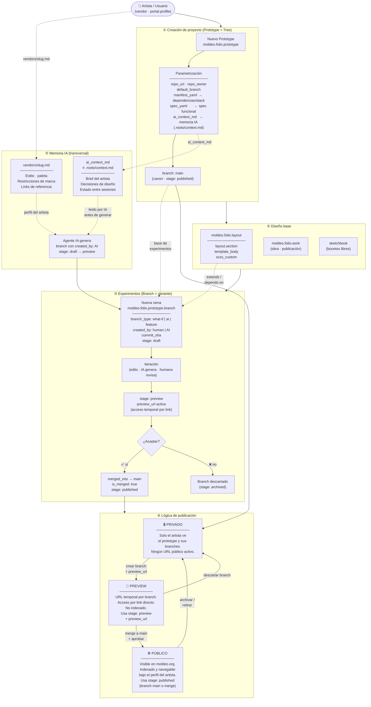

# Moldeo Lab — Ciclo de vida de proyectos, experimentos y publicación



---

## Resumen de estados (stage)

| stage | Visibilidad | URL activa | ¿Mergeable? |
|---|---|---|---|
| `draft` | Solo artista | No | No |
| `preview` | Por link directo | Sí (`preview_url`) | Sí |
| `published` | Público en moldeo.org | Sí (perfil artista) | — (ya es canon) |
| `archived` | Ninguna | No | No |

## Regla de propiedad

```
prototype  ──── pertenece-a ────▶  vendor (artista)
prototype  ──── extends ─────────▶ layout base  (arista, no anidamiento)
branch     ──── bifurca-de ──────▶ prototype (main)
branch     ──── created_by ──────▶ human | AI
branch     ──── merged_into ─────▶ main  (cuando se aprueba)
```

> Un branch **nunca** pertenece a dos artistas.  
> Una variante que deriva del trabajo de otro artista es un nuevo **prototype** (fork), no un branch del original.
